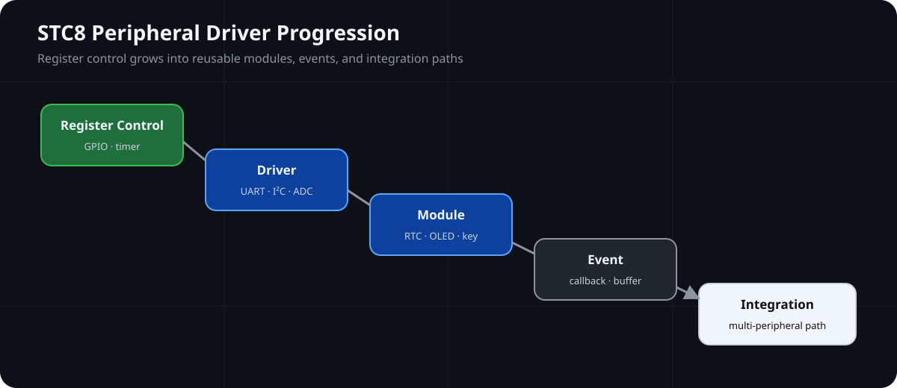

# STC8-MCU-Learning

基于 STC8H8K64U 的增强型 8051 固件与外设集成工程集合，重点展示驱动封装、事件处理、通信缓冲和板级资源约束。

**⚙️ Peripheral Driver Progression**



## Firmware Snapshot

| Firmware Focus | Current Scope |
| --- | --- |
| MCU | STC8H8K64U，enhanced 8051 |
| Driver Progression | Register → Driver → Module → Event → Integration |
| Interfaces | GPIO、Timer、UART、I²C、ADC、PWM、USB HID |
| Integration Model | Callbacks、interrupt buffers、RTX51 Tiny example |
| Evidence | Source and documentation review；build and hardware evidence not provided |

> 📟 **Evidence:** Driver and integration paths documented · Build, hardware, and runtime evidence not provided

## 📌 Overview

仓库围绕 STC8H8K64U 的 GPIO、Timer、UART、PWM、ADC、RTC、OLED、传感器、USB HID 和 RTX51 Tiny 示例组织代码。各工程保持独立边界，用于查看从寄存器控制、外设驱动到模块封装、事件回调和任务协作的实现路径。

这里展示的是可定位到源码和文档的固件机制，不把独立示例描述成已经完成的统一产品。组合不同模块前，需要重新核对引脚复用、定时器占用、通信模式和目标芯片配置。

## 🏗️ Architecture

```text
Application
  页面状态 / 命令处理 / 数据格式化 / 任务入口
                         ↓
Modules
  Key / RTC / OLED / DHT11 / EEPROM / UART buffer
                         ↓
Drivers
  GPIO / Timer / UART / I²C / ADC / PWM / USB
                         ↓
STC8 Hardware
  STC8H8K64U / PCF8563 / SSD1306 / 74HC595 / CH340N
```

工程结构从直接寄存器控制逐步扩展到厂商外设接口、独立模块、事件回调、中断缓冲和任务协作：

```text
寄存器控制 → 外设驱动 → 模块封装 → 事件管理 → 多外设协作 → 任务调度
```

## ✨ Key Features

| Capability | Implementation Entry |
| --- | --- |
| Key event handling | [按键事件系统](projects/02_外设驱动/04_按键事件系统/) 使用状态位和函数指针分发按下/释放事件 |
| Buffered UART communication | [UART 通信](projects/03_通信接口/01_UART通信/) 通过 UART1 ISR、接收缓冲区和空闲超时组织数据路径 |
| RTC and display interfaces | [RTC 时间系统](projects/02_外设驱动/06_RTC时间系统/) 与 [OLED 显示](projects/02_外设驱动/07_OLED显示/) 分别展示硬件和软件 I²C 路径 |
| Resource-aware integration | [RTC + OLED 整合](projects/05_综合实践/01_RTC_OLED时间显示/) 记录 I²C、引脚和板载资源之间的约束 |
| Task interaction | [RTX51 Tiny](projects/04_软件设计/01_RTX51_Tiny/) 展示 task、tick、signal 与 UART 事件协作 |

## 📂 Project Structure

```text
STC8-MCU-Learning/
├── projects/01_MCU基础/    # GPIO 与寄存器入口
├── projects/02_外设驱动/  # Timer、PWM、ADC、按键、显示、RTC、传感器与 IAP
├── projects/03_通信接口/  # UART 与 USB HID
├── projects/04_软件设计/  # RTX51 Tiny 任务协作
├── projects/05_综合实践/  # 多外设组合示例
├── docs/                  # 架构、引脚复用、构建与调试说明
└── assets/images/         # 已有硬件与接口参考图
```

## 📚 Documentation

- [文档索引](docs/README.md)
- [核心板与引脚复用](docs/核心板与引脚复用.md)
- [工程结构演进](docs/工程结构演进.md)
- [开发环境与构建](docs/开发环境与构建.md)
- [调试记录](docs/调试记录.md)
- [Smart Terminal 资源设计](docs/smart-terminal-design.md)：资源规划文档，当前不包含对应的集成工程源码

## 🧪 Verification

### 💻 Host Test

**Status:** Not Applicable. 工程面向 STC8 MCU，不包含 Host Test 入口。

### 🔨 Build Verification

**Status:** Not Provided. 仓库未提供与当前公开版本对应的可复现 Keil 构建记录。

### 🔌 Hardware Validation

**Status:** Not Provided. 当前公开文档未提供可复核的板端测试记录。

### 📊 Runtime Evidence

**Status:** Not Provided. 当前仓库未提供串口日志、USB 枚举记录或测量结果作为运行证据。

构建和下载配置入口见[开发环境与构建](docs/开发环境与构建.md)。历史构建文件或工程文件存在，不等同于当前构建或硬件验证通过。

## License Boundary

根目录 `LICENSE` 适用于仓库维护者编写并由其明确覆盖的内容，不改变示例源码、STC 厂商组件和图片各自的权利状态。第三方组件、课程示例与图片来源边界见 [THIRD_PARTY_NOTICES.md](THIRD_PARTY_NOTICES.md)。
