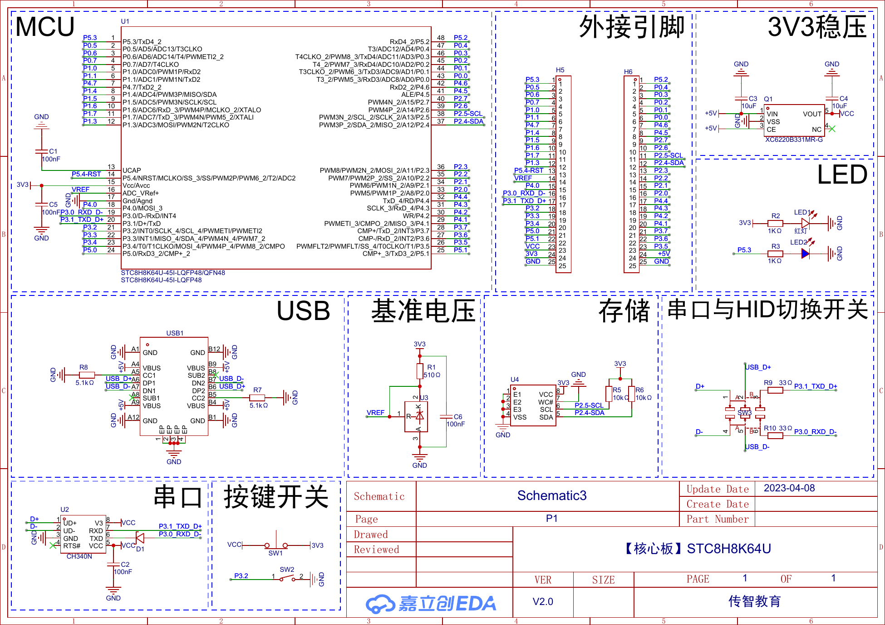

# 核心板与引脚复用

## 板载资源

| 资源 | 连接 |
| --- | --- |
| 板载 LED | P5.3，低电平/高电平行为以工程接法为准 |
| 板载按键 | P3.2 |
| CH340N UART | P3.0/RXD、P3.1/TXD |
| USB D-/D+ | 与 P3.0/P3.1 路径通过开关切换 |
| 串行存储器 | P2.5/SCL、P2.4/SDA |
| 电源 | Type-C 5 V 输入，板上 3.3 V 稳压 |

## 项目中的外设连接

- PWM 振动电机：PWM6 映射到 P0.1。
- ADC/NTC：P0.5，ADC_CH13。
- 独立按键组：P5.1-P5.4。
- 数码管 74HC595：P4.4 数据、P4.2 移位时钟、P4.3 锁存时钟。
- DHT11：P4.6。
- PCF8563：工程使用硬件 I²C 引脚组 P3.2/P3.3；P3.2 同时连接板载按键，组合使用时需要处理资源冲突。

引脚复用由 `Switch.h` 中的切换宏和对应外设寄存器共同决定。移植工程时不能只复制驱动函数，还要核对引脚组、板载开关和外设占用。
