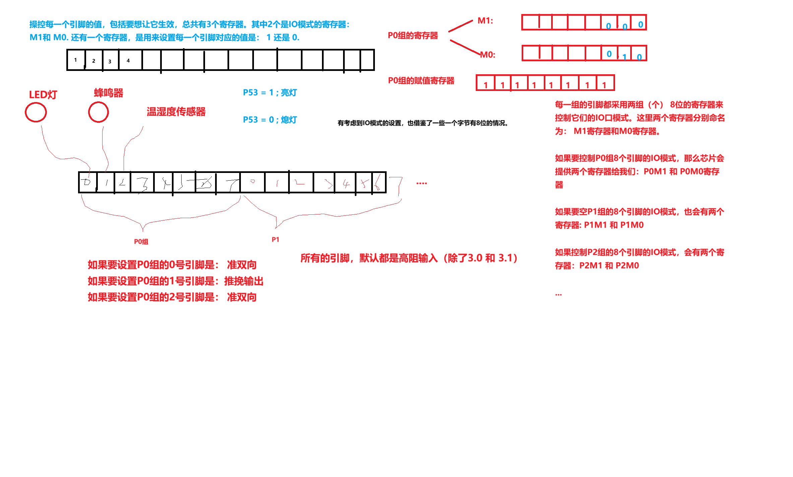

# GPIO 模块

## 项目简介

使用 STC8H8K64U 的 P5.3 控制板载 LED。工程从 `Config.h` 读取 24 MHz 主频，通过 STC GPIO 库配置端口模式，并用延时形成周期亮灭。

## 硬件环境

- MCU：STC8H8K64U
- 输出：P5.3 板载 LED
- GPIO 模式：`GPIO_OUT_PP`



## 软件结构

```text
main.c
  ├─ GPIO_Inilize(GPIO_P5, ...)
  ├─ P53 = 0 / 1
  └─ delay_ms()

GPIO.c/.h   端口模式配置
Delay.c/.h  基于主频的软件延时
Config.h    系统时钟
```

## 数据流程

`GPIO 配置 -> 输出电平 -> LED 状态变化 -> 延时 -> 切换电平`

## 关键实现

`GPIO_InitTypeDef` 指定 P5.3 和推挽输出模式。`GPIO_Inilize()` 根据端口号修改对应 PnM0/PnM1，随后 `main()` 直接写 P53。

## 调试记录

端口输出值正确但 LED 不亮时，需要同时检查端口模式、LED 有效电平和板载连接。软件延时依赖 `MAIN_Fosc`，主频配置错误会直接改变闪烁周期。

## 来源说明

`course/` 保留课程的 GPIO 库函数与 Delay 示例，未修改运行逻辑。
