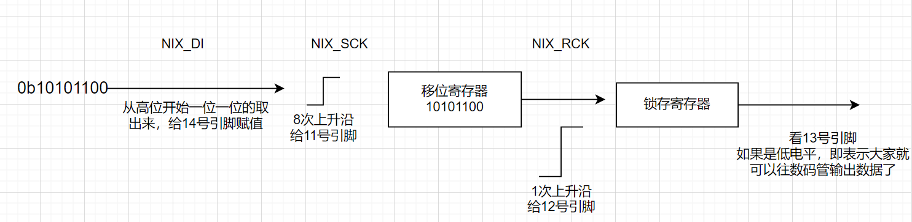

# 74HC595 数码管驱动

## 项目简介

通过级联移位寄存器发送段码与位选数据，再用锁存信号同时更新数码管输出。

## 硬件环境

- 数据：P4.4 / `NIX_DI`
- 移位时钟：P4.2 / `NIX_SCK`
- 锁存时钟：P4.3 / `NIX_RCK`
- 外设：74HC595 与多位数码管



## 软件结构

```text
main.c
  ├─ NIXIE_Init()
  └─ NIXIE_Show_Number()

NIXIE.c
  ├─ LED_TABLE[]
  ├─ NIXIE_Show(dat, dig)
  └─ NIXIE_Show_Number(num, dig)
```

## 数据流程

`数字索引 -> 段码表 -> 8-bit 段选 -> 8-bit 位选 -> RCK 锁存 -> 数码管`

## 关键实现

`NIXIE_Show()` 从高位到低位发送两个字节。SCK 每跳变一次推进一位数据，16 位发送完成后 RCK 统一更新输出，避免移位过程中显示中间状态。

## 调试记录

显示错位时先核对段码、位选顺序和共阴/共阳极性；乱码通常来自发送位序或移位/锁存时钟接反。

## 来源说明

`course/` 保留课程数码管封装（二）工程。
