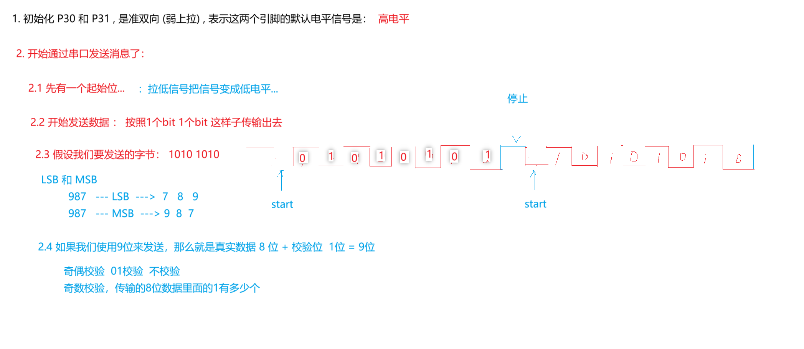

# UART 中断通信

## 项目简介

UART1 使用 Timer1 产生 115200 baud，接收中断把字节写入缓冲区，主循环在空闲超时后处理一帧数据。

## 硬件环境

- MCU：STC8H8K64U，24 MHz
- UART1：P3.0/RXD、P3.1/TXD
- USB 转串口：板载 CH340N



## 软件结构

```text
main.c
  ├─ UART_Config()
  └─ frame processing

UART_Isr.c
  ├─ RI handling
  ├─ RX1_Buffer
  └─ RX_TimeOut

UART.c/.h   波特率和收发接口
NVIC.c/.h   UART1 中断配置
```

## 数据流程

`RXD -> UART1 ISR -> RX1_Buffer -> idle timeout -> main processing -> TXD`

## 关键实现

ISR 只记录字节、计数和超时值，主循环等待一段空闲后再处理完整缓冲区。该结构比在 ISR 中直接解析命令更容易控制中断执行时间。

## 调试记录

串口无输出时依次检查：核心板模式开关、P3.0/P3.1 交叉连接、主频、Timer1 波特率参数和上位机波特率。UART 与 USB HID 不能在相同板卡路径下同时占用这组引脚。

## 来源说明

`course/` 保留课程 UART 接收工程。
