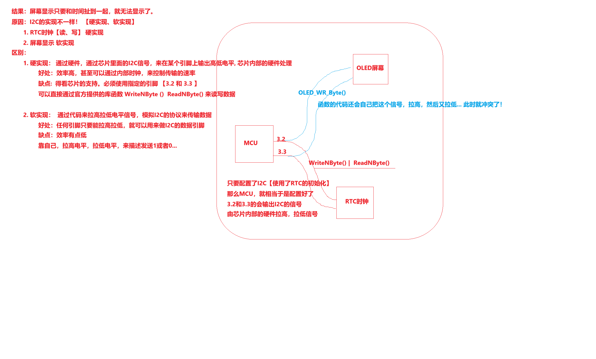

# RTC + OLED 时间显示

## 项目简介

PCF8563 提供日期和时间，OLED 显示格式化结果。工程同时使用 STC8 硬件 I²C 访问 RTC，并使用 GPIO 模拟 I²C 驱动 OLED。

## 硬件环境

- MCU：STC8H8K64U，24 MHz
- RTC：PCF8563
- 显示：0.96 英寸 OLED
- 调试：UART1



## 软件结构

```text
main.c
  ├─ RTC_Init()
  ├─ OLED_Init()
  ├─ RTC_ReadTime()
  ├─ sprintf(date/time)
  └─ OLED_ShowString()

RTC.c + I2C.c   硬件 I²C 时间读取
oled.c          软件 I²C 显示输出
```

## 数据流程

`PCF8563 registers -> hardware I²C -> RTC_Time -> formatted strings -> software I²C -> OLED`

## 关键实现

硬件 I²C 和软件 I²C 使用不同驱动路径，避免两个设备库争用同一套接口实现。RTC 负责 BCD/十进制转换，应用层只处理格式化和页面布局。

## 调试记录

课程整合时处理了延时函数、寄存器头文件和整数类型的重复定义。当前 `main.c` 仍在启动时写固定 RTC 时间，实际长期运行版本应将初始化与日常读取分开。

## 来源说明

`course/` 保留课程 OLED 显示时间工程，包含 PCF8563、OLED 和 STC 厂商驱动代码。
